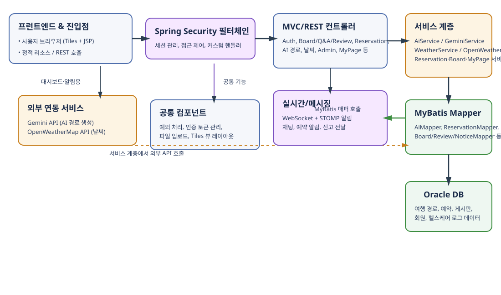

# TripBear 시스템 아키텍처 개요

아래 다이어그램은 TripBear의 주요 계층과 통합 지점을 요약합니다. `doc/architecture.svg` 파일을 열어 확대/축소하며 살펴볼 수 있습니다.

## 구성 요약
- **프런트엔드 & 진입점**: Tiles 기반 JSP 뷰와 정적 리소스가 브라우저에서 렌더링되며, REST 호출로 백엔드와 통신합니다.
- **보안 계층**: `CustomUserDetailsService`, `SessionUrlSavingFilter` 등 Spring Security 필터체인이 세션 관리와 접근 제어를 담당합니다.
- **웹/REST 컨트롤러**: AI 경로(`AiRestController`), 예약, 게시판, 마이페이지, 관리자 등의 모듈별 컨트롤러가 요청을 수신합니다.
- **서비스 계층**: 비즈니스 로직이 모듈별 서비스로 분리됩니다. 예를 들어 `AiServiceImpl`은 Gemini AI와 날씨 정보를 조합해 경로를 생성하고, `WeatherServiceImpl`은 OpenWeatherMap API를 호출해 날씨를 가공합니다.
- **데이터 액세스**: MyBatis 매퍼(`AiMapper`, `ReservationMapper`, `ReviewMapper` 등)가 Oracle DB에 접근해 경로, 예약, 게시판, 회원 데이터를 처리합니다.
- **외부 연동**: Gemini API와 OpenWeatherMap API를 호출해 AI 경로와 날씨 정보를 제공하며, WebSocket/STOMP로 실시간 알림을 전달합니다.
